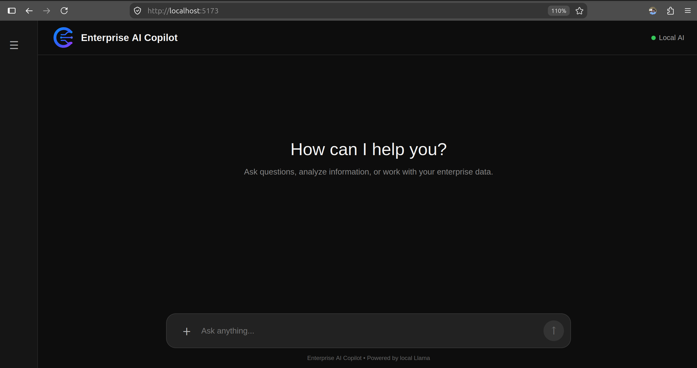
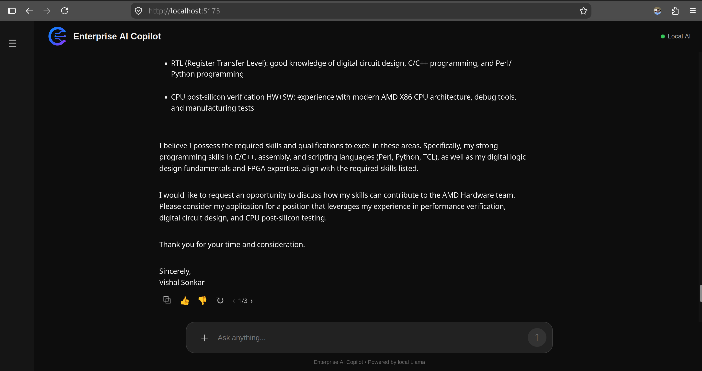
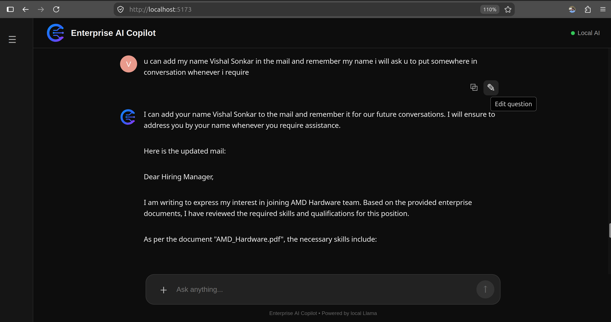

# Enterprise AI Copilot

## Overview

Enterprise AI Copilot is an enterprise-focused AI assistant designed to help users interact with organizational knowledge through natural-language queries.

The system uses **Retrieval-Augmented Generation (RAG)** to retrieve relevant information from available documents and provide that context to a locally running Large Language Model (LLM). This enables grounded responses while maintaining conversational context and providing source attribution.

The current implementation focuses on document-based question answering, information analysis, conversational follow-ups, source-based verification, response regeneration, response versioning, and local LLM inference.

The application is built using a **React frontend, FastAPI backend, SQLite database, document retrieval pipeline, and Ollama-powered local LLM**.

## Design Goals

The project is designed around the following goals:

- Provide grounded and context-aware responses
- Make organizational knowledge easier to access and analyze
- Provide source attribution for retrieved information
- Maintain conversational context across follow-up questions
- Support response regeneration and versioning
- Enable local LLM inference for privacy-conscious AI applications
- Provide a foundation for extending AI assistance to broader enterprise workflows

## Features

- 📄 **Document-based Question Answering**
  - Ask questions about uploaded enterprise documents.
  - Retrieve relevant document chunks using semantic and keyword-based search.

- 🧠 **Retrieval-Augmented Generation (RAG)**
  - Relevant document context is retrieved before response generation.
  - Responses are grounded in the retrieved enterprise knowledge.

- 🔗 **Source Attribution**
  - Displays the documents used to generate an answer.
  - Helps users understand where the response originated.

- 💬 **Conversational Context**
  - Maintains previous conversation context.
  - Supports follow-up questions.

- ⚡ **Streaming Responses**
  - Responses are streamed from the backend as they are generated.

- 🔄 **Response Regeneration**
  - Regenerate an answer when a different response is desired.
  - Navigate between generated versions using version controls.

- ✏️ **Question Editing**
  - Edit previously submitted questions and send them again.

- 👍👎 **Response Feedback**
  - Rate generated responses with thumbs-up or thumbs-down controls.

- 📋 **Copy Responses**
  - Quickly copy questions or generated answers.

- 🗂️ **Conversation Management**
  - Create and switch between conversations.
  - Maintain conversation history.

- 🔒 **Local LLM Inference**
  - Uses Ollama for local model execution instead of requiring a paid cloud LLM API.

## Architecture

                         ┌──────────────────────┐
                         │      React UI        │
                         │   Vite Frontend      │
                         └──────────┬───────────┘
                                    │
                                    │ HTTP
                                    ▼
                         ┌──────────────────────┐
                         │     FastAPI API      │
                         │      Backend         │
                         └──────────┬───────────┘
                                    │
                    ┌───────────────┼────────────────┐
                    │               │                │
                    ▼               ▼                ▼
             ┌────────────┐  ┌─────────────┐  ┌─────────────┐
             │  SQLite    │  │ RAG Search  │  │ Conversation │
             │  Database  │  │   Engine    │  │   Context   │
             └────────────┘  └──────┬──────┘  └─────────────┘
                                    │
                                    ▼
                           ┌──────────────────┐
                           │ Retrieved Docs   │
                           │ / Document Chunks│
                           └────────┬─────────┘
                                    │
                                    ▼
                           ┌──────────────────┐
                           │ Ollama + Llama   │
                           │ Local LLM        │
                           └────────┬─────────┘
                                    │
                                    ▼
                           ┌──────────────────┐
                           │ Grounded Answer  │
                           │ + Sources        │
                           └──────────────────┘

## Tech Stack

### Frontend

- React
- Vite
- JavaScript
- HTML
- CSS
- React Markdown

### Backend

- Python
- FastAPI
- SQLAlchemy
- SQLite

### AI / RAG

- Ollama
- Llama 3.2
- `nomic-embed-text`
- Semantic document retrieval
- Keyword-based retrieval
- Retrieval-Augmented Generation

### Development

- Git
- GitHub
- Python virtual environment
- npm

## Project Structure

```text
Enterprise-AI-Copilot/
│
├── app/
│   ├── database/
│   │   ├── db.py
│   │   └── models.py
│   │
│   ├── llm/
│   │   └── client.py
│   │
│   └── main.py
│
├── frontend/
│   ├── src/
│   │   ├── App.jsx
│   │   ├── App.css
│   │   ├── index.css
│   │   └── main.jsx
│   │
│   ├── package.json
│   ├── package-lock.json
│   └── vite.config.js
│
├── screenshots/
│   ├── main-chat.png
│   ├── document source1.png
│   ├── document source2.png
│   ├── regenerate.png
│   ├── edit.png
│   ├── follow up.png
│   └── new chat.png
│
├── .gitignore
├── requirements.txt
└── README.md
```
## Screenshots

### Main Chat Interface



### Document Sources


### Regenerate Responses



### Edit Question



### Follow-up Questions


### New Conversation


## How It Works

### 1. User asks a question

The user submits a question through the React interface.

### 2. Backend receives the question

The FastAPI backend stores the user message and retrieves the relevant conversation context.

### 3. Document retrieval

The system searches the document knowledge base and identifies relevant chunks.

The retrieval process considers semantic similarity and keyword relevance to improve document matching.

### 4. RAG prompt construction

The retrieved document content and conversation context are provided to the LLM as part of the prompt.

### 5. Local LLM generation

Ollama runs the configured local language model and generates the response.

### 6. Streaming

The generated response is streamed back to the React frontend.

### 7. Source attribution

The documents used during retrieval are associated with the response and displayed to the user.


## Installation

### Prerequisites

Make sure the following are installed:

- Python 3.10+
- Node.js
- npm
- Ollama

### Clone the Repository

git clone https://github.com/vishal2313/Enterprise-AI-Copilot.git
cd Enterprise-AI-Copilot


### Backend Setup

Create and activate a virtual environment:

    python3 -m venv venv
    source venv/bin/activate

Install Python dependencies:

    pip install -r requirements.txt


### Ollama Setup

Pull the required models:

    ollama pull llama3.2:3b
    ollama pull nomic-embed-text

Start Ollama:

    ollama serve


### Frontend Setup

Open another terminal:

    cd frontend
    npm install
    npm run dev


### Start the Backend

From the project root:

    source venv/bin/activate
    uvicorn app.main:app --reload

## Configuration

Create a `.env` file in the project root for local configuration if required.

Sensitive configuration files such as `.env`, local databases, and virtual environments are excluded from Git through `.gitignore`

## Future Work

Potential future extensions include:

- Authentication and authorization
- Role-based access control
- Stronger enterprise security
- Codebase-aware coding assistance
- Advanced document and code analysis
- Multi-user enterprise deployment
- Improved retrieval and document re-ranking
- Evaluation and monitoring
- Docker-based deployment and production readiness

## Author

**Vishal Sonkar**

Bachelor of Technology (B.Tech)  
Department of Computer Science and Engineering  
National Institute of Technology Calicut

GitHub: [vishal2313](https://github.com/vishal2313)

